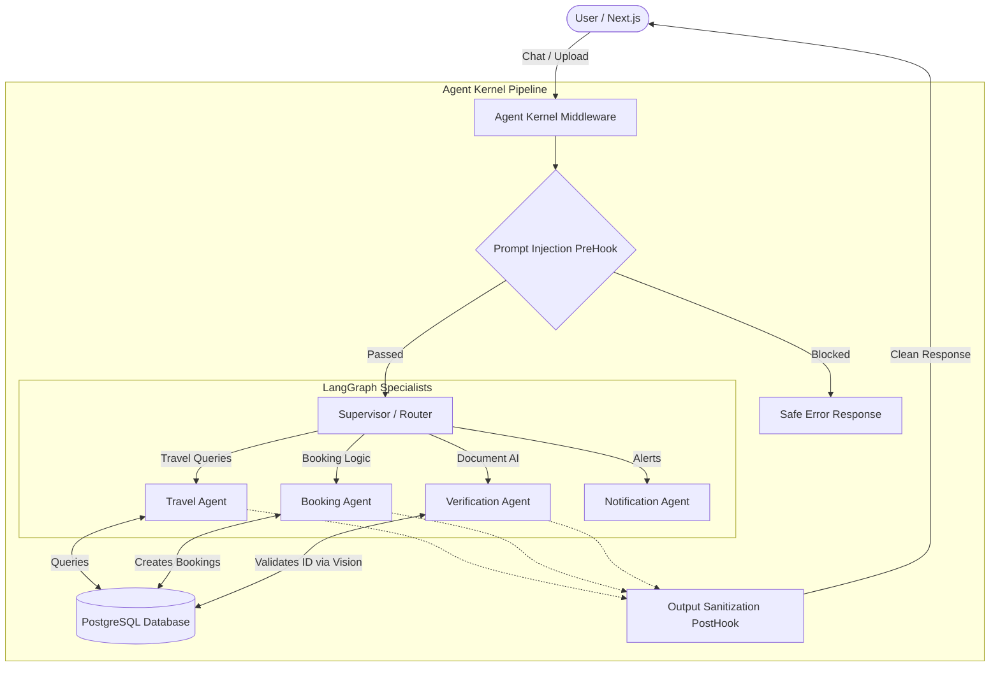

# GovSewana-AI (IDEALIZE 2026 Prototype Submission)

GovSewana-AI is a Next.js application for discoverability and booking of government-owned rest houses and circuit bungalows across Sri Lanka. Our solution incorporates a sophisticated multi-agent AI system running entirely on local hardware, prioritizing data privacy and cost-efficiency.

## Video Demonstration

*(Please insert the link to your video demonstration here)*

## What We Have Built So Far (What Users Can Do Today)

For this prototype stage, we focused on building a fully functional, AI-driven user experience. Here is exactly what users can do right now:

- **Browse and Discover:** Users can explore a beautifully designed website to discover various government rest houses and circuit bungalows.
- **View on Map:** Users can use an interactive map to visually locate properties across the country.
- **Chat with the AI:** Instead of clicking through complex search filters, users can simply type to our AI assistant (e.g., "Find me a bungalow in Nuwara Eliya for 4 people next weekend"). 
- **Upload IDs for Instant Verification:** Government employees can upload a photo of their ID card directly into the chat. Our AI's vision capabilities will read the ID and automatically verify their eligibility.
- **Book via Conversation:** Once a user finds a place they like, they can just ask the AI to book it. The AI automatically handles the booking process in the background and saves their reservation for approval.

## Technical Architecture & Agent System

In alignment with the Open Category prototype guidelines, our application features a **Functioning AI Agent System**, heavily customized using **Agent Kernel** and **LangGraph**. We run a **Multi-Model Architecture** locally via Ollama to balance speed, reasoning, and vision capabilities.

### Multi-Model Local AI Implementation

- **Supervisor (Router) Agent:** Powered by `llama3.2:3b`. A lightning-fast, lightweight model used strictly to evaluate user intent and route them to the appropriate specialist agent (Travel, Booking, Verification, or Notification).
- **Reasoning Agents (Travel & Booking):** Powered by `qwen2.5:7b`. Handles complex logic, state manipulation, and strict tool-calling to safely interact with our PostgreSQL database.
- **Verification Agent (Document AI):** Powered by `qwen2.5-vl`. Handles our Vision/Document AI pipeline to securely read and verify uploaded government employee slips.
- **Agent Kernel Hooks:** A PreHook intercepts and blocks prompt injections, and a PostHook sanitizes all database outputs to prevent stack-trace leaks.

## Tech Stack

- **Frontend Framework:** Next.js 16
- **Styling & UI:** Tailwind CSS v4 + Framer Motion + Lucide React
- **Mapping:** Leaflet.js (`react-leaflet`)
- **Database & ORM:** PostgreSQL + Prisma
- **AI Orchestration:** Agent Kernel + LangGraph
- **AI Models:** Local LLMs via Ollama (`llama3.2`, `qwen2.5`, `qwen2.5-vl`)

## Future Plans (Next Phase)

Based on our original application blueprint, the following features are planned for future implementation:
- **Dashboards:** Dedicated department dashboard for managing reservations and an analytics dashboard for occupancy insights.
- **Secure Authentication:** Implementation of role-based access control for public users, government employees, and admins.
- **Complete Booking Lifecycle:** Expanding the booking agent to handle full payment confirmations and automated status notifications.
- **Advanced UI Filtering:** Expanding the Next.js UI to support granular filtering by department, budget, and capacity alongside the AI chat.

## Pivots from Original Proposal

During the development process, we had to make several key pivots from our initial proposal to better fit technical requirements and government constraints:

- **AI Engine (The Biggest Pivot):** Initially, we proposed using the Gemini Flash API. However, to ensure maximum data privacy for government employee data and document uploads, we completely pivoted to using **Local LLMs** (`llama3.2` and `qwen2.5`). 
- **Agent Orchestration with Agent Kernel:** Instead of using n8n or a simple API wrapper, we adopted **Agent Kernel** paired with **LangGraph**. This required a massive architectural shift and a steep learning curve. We had to build, test, and debug the agent logic in a completely separate repository (`agent-kernel`) and figure out how to integrate it. While it took a lot of effort to understand Agent Kernel's hooks, supervisors, and session management, it ultimately allowed us to build an enterprise-grade multi-agent system with real reasoning, prompt injection security, and multi-step workflows.

---

