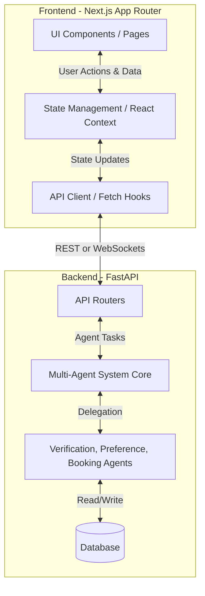

# GovSewana Architecture & Integration Guide

To build a scalable GovSewana platform with multiple pages on the frontend and a Multi-Agent System (MAS) powered by FastAPI on the backend, you need a clean separation of concerns and a robust communication layer.

Here is the recommended architecture for handling the frontend (Next.js) and backend (FastAPI).

## 1. High-Level Architecture Overview



## 2. Handling the Frontend (Next.js App Router)

Since you are using Next.js (as seen by the `app/page.tsx` file), you should leverage the **App Router** to manage multiple pages easily.

### Folder Structure for Multiple Pages
In Next.js, the folder structure determines the routing.
```text
govstay-ai/
├── app/
│   ├── layout.tsx         # Global layout (Navigation, Footer, Providers)
│   ├── page.tsx           # Home / Landing Page
│   ├── chat/
│   │   └── page.tsx       # The Agent Platform (our current page.tsx)
│   ├── browse/
│   │   └── page.tsx       # Browse Bungalows Page
│   └── bookings/
│       └── page.tsx       # User's Bookings Page
├── components/            # Reusable UI components
│   ├── ui/                # Buttons, Inputs, Cards
│   ├── layout/            # TopNav, Sidebar
│   └── chat/              # ChatBubble, AgentStatus
├── lib/                   # API clients, utility functions
│   └── api.ts             # Axios or fetch wrappers to talk to FastAPI
```

### Key Frontend Practices:
1. **Component Extraction**: We should break down the massive `page.tsx` into smaller, reusable components (e.g., `<TopNav />`, `<ChatInterface />`, `<AgentPipeline />`).
2. **State Management**: For chat history and agent status, React's `useState` and `useRef` (what we are currently using) work well, but you might want to look into `Zustand` or `React Context` if the state needs to be shared across multiple pages.

## 3. Handling the Backend (FastAPI + MAS Integration)

FastAPI is a perfect choice for an AI-heavy backend because it is fast, supports asynchronous programming (`async/await`), and handles WebSockets beautifully (which is critical for streaming AI agent responses).

### Communication Methods
Since MAS (Multi-Agent Systems) take time to process tasks (e.g., verifying identity, searching for properties), you shouldn't use standard blocking HTTP requests. 

You have two main options for the Next.js <-> FastAPI connection:

**Option A: WebSockets (Recommended for MAS)**
WebSockets keep an open connection between the browser and FastAPI. When the user sends a message, FastAPI streams back real-time updates as different agents pick up the task.
- *Frontend*: Use the native `WebSocket` API or libraries like `socket.io-client` (if using `python-socketio` in backend).
- *Backend*: Use FastAPI's native `WebSocket` routing.

**Option B: Server-Sent Events (SSE) / Streaming REST**
If you don't want full WebSockets, you can use standard HTTP requests where FastAPI streams the response chunk-by-chunk. This is how ChatGPT's interface works.

### Example FastAPI Setup for MAS
```python
# main.py (FastAPI)
from fastapi import FastAPI, WebSocket
import asyncio

app = FastAPI()

@app.websocket("/ws/chat")
async def websocket_endpoint(websocket: WebSocket):
    await websocket.accept()
    while True:
        # 1. Receive user message
        data = await websocket.receive_text()
        
        # 2. MAS System Processing Pipeline
        # Trigger Verification Agent
        await websocket.send_json({"agent": "Verification Agent", "status": "processing"})
        await asyncio.sleep(1) # Simulate work
        await websocket.send_json({"agent": "Verification Agent", "status": "Identity Verified."})
        
        # Trigger Preference Agent
        await websocket.send_json({"agent": "Preference Agent", "status": "processing"})
        # ... logic to fetch property ...
        await websocket.send_json({
            "sender": "ai",
            "agent": "Preference Agent",
            "text": f"Found a property for your request: {data}",
            "propertyCard": {
                "title": "Nuwara Eliya Rest House",
                "price": "Rs. 18,500"
            }
        })
```

## 4. Next Steps for Development

To transition from the current "mocked" frontend to a full-stack integrated application, here is the roadmap you should follow:

1. **Refactor the Frontend**: Break the current `page.tsx` into smaller components inside a `components/` directory. Move the main chat interface to `app/chat/page.tsx` and create a Landing page for `app/page.tsx`.
2. **Setup FastAPI**: Create a new python project (e.g., `backend/`), initialize FastAPI, and set up CORS to allow Next.js (`localhost:3000`) to communicate with it.
3. **Build the API Client**: In Next.js, create a `lib/api.ts` file to handle connections to the FastAPI backend (either via `fetch` or WebSockets).
4. **Connect the Dots**: Replace the hardcoded `setTimeout` fake AI responses in `page.tsx` with actual calls to your FastAPI backend.

> [!TIP]
> **CORS is crucial!** When developing locally, Next.js runs on port `3000` and FastAPI usually runs on port `8000`. You MUST configure FastAPI's `CORSMiddleware` to allow requests from `http://localhost:3000`, otherwise the browser will block the connection.
